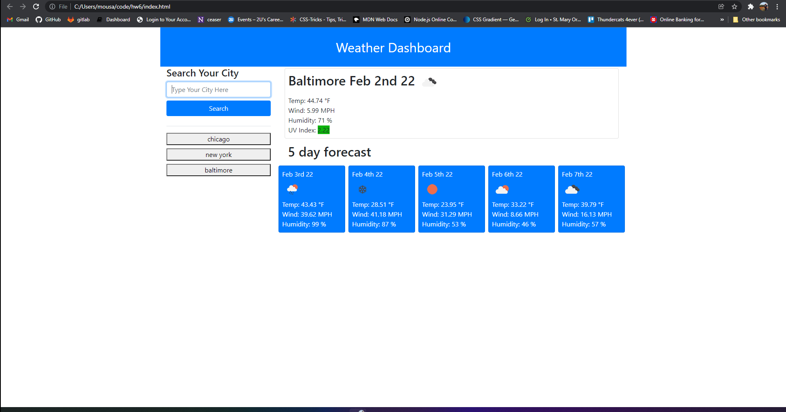

# 06 Server-Side APIs: Weather Dashboard

# Project description

In this app, the user enters the name of a city in the search field, then clicks the search button. The app will display the current weather conditions in that city, including temperature, humidity, UV index (with colors that indicate the conditions to be favorable, moderate, or severe), and a picture representing whether it is clear, cloudy, raining, etc. Additionally, a 5-day forecast for that city is displayed below the current conditions showing similar information.

